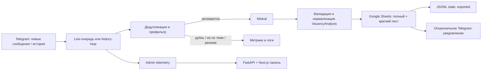

# Текущее состояние продукта

Документ фиксирует фактическое состояние репозитория на 13 августа 2026 года.
Источник истины — исходный код и тесты. Секретные и пользовательские файлы
(`.env`, credentials, Telegram session, state и экспортированные данные) не
анализировались.

## 1. Краткое описание

Проект собирает Go/Golang-вакансии из Telegram. Он слушает заданные каналы и
группы, отсеивает нерелевантные сообщения и резюме кандидатов, передаёт
подходящие тексты в Mistral и сохраняет структурированный результат в Google
Sheets. При включённой настройке после экспорта публикуется краткое Telegram-
уведомление.

С системой взаимодействуют Telegram-аккаунт пользователя через Telethon,
Mistral API, Google Sheets и администратор через CLI либо защищённую веб-
панель. Главный результат — полный и краткий листы с вакансиями в одной Google
таблице.

Основная логика: `src/tg_vacancy_bot/pipeline/processor.py` (`VacancyProcessor`).

## 2. Стек и границы системы

| Область | Технологии / сервисы | Роль |
|---|---|---|
| Основное приложение | Python 3, asyncio | Оркестрация обработки вакансий |
| Telegram | Telethon | Userbot, QR-авторизация, история и live-события |
| LLM | Mistral API через OpenAI SDK | Определение релевантности и извлечение структуры |
| Экспорт | Google Sheets API, gspread, google-auth | Создание и заполнение двух листов |
| Конфигурация | `.env`, Pydantic-managed JSON | Секреты и не секретные управляемые настройки |
| Локальное состояние | JSONL/JSON | Дедупликация, причины пропусков, метрики, логи, ошибки, alert state |
| HTTP/API | FastAPI, Uvicorn | Admin API и раздача статического интерфейса |
| Frontend | Next.js static export, React, TypeScript, Tailwind, RHF, Zod | Русскоязычная админ-панель |
| Контейнеризация | Docker, Docker Compose | Сервисы `bot` и `admin` |
| CI/CD | GitHub Actions, SSH | Проверки, передача образа на VPS, deploy/rollback |

- Локально хранятся session Telegram, JSONL дедупликации, managed-настройки,
  агрегированные метрики, очищенные логи и ошибки в `DATA_DIR`/`data`.
- Внешние сервисы: Telegram, Mistral, Google Sheets.
- Реляционной или документной БД нет.
- HTTP API существует: `/api/v1/*` и `/healthz`.
- Frontend существует в `web/`.
- CLI-сценарии: авторизация, live-мониторинг, history, discovery источников,
  синхронизация Telegram-папки, Telegram smoke-test.

Основания: `requirements.txt`, `web/package.json`, `compose.yaml`.

## 3. Архитектура и модули

- `config.py` объединяет `.env` и managed-настройки. После первого сохранения
  панели settings JSON имеет приоритет для поддерживаемых не секретных полей.
- `scripts/run_live.py` принимает live-события; `scripts/parse_history.py`
  обрабатывает историю; `telegram/links.py` строит ссылки и стабильные ID.
- `pipeline/processor.py` соединяет фильтрацию, LLM, экспорт, дедупликацию,
  метрики и уведомления.
- `llm/mistral.py` выполняет запросы; `llm/prompts.py` отделяет изменяемые
  инструкции от фиксированного JSON-контракта; `llm/schemas.py` валидирует
  ответ.
- `pipeline/dedupe_state.py` хранит экспортированные ссылки/ID бессрочно, а
  текстовые хэши — в пределах TTL.
- `storage/sheets.py` экспортирует в полный и краткий листы.
- `admin/api.py`, `admin/settings.py`, `admin/telemetry.py` реализуют панель,
  настройки и наблюдаемость.
- Python-тесты находятся в `tests/`, frontend tests — в `web/components`, E2E
  — в `web/tests/e2e`.

## 4. Бизнес-логика

### Live-обработка новых сообщений

Вход — `Telethon.events.NewMessage` для `TARGET_CHANNELS`. Обработчик создаёт
`LiveMessageJob` и неблокирующе помещает его в ограниченную `asyncio.Queue`.
Worker вызывает `VacancyProcessor.process_message`. При остановке новые
события не принимаются, а сервис ждёт завершения очереди до 30 секунд.

Если очередь заполнена, конкретное сообщение логируется как пропущенное и не
ставится на повтор. Реализация: `scripts/run_live.py`.

### Обработка истории

`scripts/parse_history.py` последовательно проходит `TARGET_CHANNELS` через
`client.iter_messages` и прекращает проход на сообщениях старше
`HISTORY_DAYS`. Для каждого сообщения применяется общий processor. Уведомления
истории выключены, пока явно не включен `TELEGRAM_NOTIFY_HISTORY`.

Один Telegram session нельзя безопасно одновременно использовать для history и
live-процесса.

### Фильтрация

1. Пустой текст — невалидный.
2. Строится SHA-256 нормализованного текста.
3. Проверяется дубль по ссылке/стабильному ID и хэшу текста в пределах TTL.
4. Проверяются ключевые слова с границами слов.
5. Применяются exclude-слова.
6. Исключаются резюме по прямым маркерам (`#резюме`, `open to work`, «ищу
   работу») либо сочетанию resume-признаков без признаков найма.

Для пропущенных сообщений Mistral не вызывается. Telemetry сохраняет только
агрегированную причину: пустой текст, вид дубликата, include/exclude-prefilter,
резюме, полная очередь, отказ LLM, ошибка LLM или ошибка экспорта. Реализация:
`pipeline/prefilter.py`, `pipeline/fingerprints.py`.

### LLM-анализ

Система отправляет system prompt и исходный текст в Mistral с
`response_format={"type":"json_object"}`. API-ошибки, ошибки JSON и
нарушения схемы повторяются ограниченное число раз: стандартно две попытки.
`is_match=false` не экспортируется.

Панель редактирует только инструкции. Фиксированная JSON-схема ответа остаётся
в коде: `llm/prompts.py`, `llm/mistral.py`, `llm/schemas.py`.

### Дедупликация, запись и уведомление

Стабильный ID строится из Telegram-ссылки. Полный лист содержит 37 колонок и
исходный текст, краткий — 13 пользовательских колонок; ID краткой записи
хранится в note ячейки ссылки. При частичном сбое повторный запуск добавляет
только недостающую строку.

Событие `exported` пишется в state только после успеха в обоих листах. Ошибка
Telegram-уведомления не отменяет экспорт и дедупликацию. Реализация:
`storage/sheets.py`, `pipeline/dedupe_state.py`, `telegram/notifier.py`.

## 5. Контракты и модели данных

### Внутренние Python-контракты

| Контракт | Назначение |
|---|---|
| `VacancyAnalysis` | Frozen dataclass из 30 полей извлечённой вакансии |
| `VacancyProcessor.process_message(...) -> bool` | Общий async pipeline; `True` после успешного экспорта |
| `JsonlDedupeState.is_duplicate(...)` | Проверка ссылки, ID и хэша текста |
| `JsonlDedupeState.mark_exported(...)` | Фиксация успешного экспорта |
| `ManagedSource`, `AdminSettings` и вложенные модели | Версионируемые managed-настройки |
| `FolderChannel`, `ChannelSyncResult` | Контракты синхронизации папки Telegram |
| `TelemetryStore` | Heartbeat, операции, метрики с причинами, ошибки, очищенные логи |

`VacancyAnalysis` нормализует стек (`golang → Go`, `postgres → PostgreSQL`,
`k8s → Kubernetes`), грейды и фиксированные категории. Неизвестные категории
становятся `Не указано` или `Другое`; `summary` ограничен 250 символами.
Источники: `models.py`, `llm/schemas.py`.

### Внешние контракты

| Переменная | Обязательность | Назначение / default |
|---|---|---|
| `API_ID`, `API_HASH` | Да для Telegram | Telegram API; есть алиасы `TG_API_ID`, `TG_API_HASH` |
| `SESSION_NAME` | Нет | `my_account` по умолчанию |
| `SESSION_PATH`, `DATA_DIR` | Нет | Пути persistent данных и session |
| `TARGET_CHANNELS` | Нужен для мониторинга | CSV username или числовых ID |
| `TELEGRAM_CHANNELS_FOLDER` | Нет | Папка Telegram, default `Вакансии` |
| `MISTRAL_API_KEY` | Да для processing | Ключ Mistral |
| `GOOGLE_SHEET_URL` | Да для processing | Целевая таблица |
| `GOOGLE_CREDENTIALS_PATH` | Нужен для записи | Service Account JSON, default `credentials.json` |
| `OUTPUT_TIMEZONE` | Нет | `Europe/Moscow` до managed-конфигурации |
| `GOOGLE_SHEET_FULL_TITLE`, `GOOGLE_SHEET_SHORT_TITLE` | Нет | Имена листов до managed-конфигурации |
| `STATE_FILE_PATH`, `TEXT_HASH_TTL_DAYS` | Нет | `data/state.jsonl`, 30 дней |
| `LIVE_QUEUE_MAXSIZE`, `LIVE_WORKERS` | Нет | 1000 и 1 |
| `TELEGRAM_NOTIFY_*` | Target обязателен при включении | Уведомления и режим истории |
| `ADMIN_PASSWORD`, `ADMIN_SESSION_SECRET` | Да для UI | Вход и HMAC сессии |
| `ADMIN_COOKIE_SECURE`, `ADMIN_STATIC_DIR` | Нет | Cookie и каталог статической панели |

Подробное определение: `.env.example`, `config.py`.

Telegram использует Telethon user session; private-сообщения получают ссылку
`t.me/c/<id>/<message>`. Mistral должен вернуть один JSON-объект без лишних
полей; `is_match` обязателен и имеет тип `bool`. Google Sheets использует
полный лист из 37 колонок и краткий из 13. JSONL state хранит `event`,
`post_link`, `text_hash`, `created_at`.

### HTTP API

HTTP API существует. За исключением healthcheck, статуса авторизации и логина,
ручки требуют сессию администратора; все мутации требуют double-submit CSRF.

| Метод | Ручка | Назначение |
|---|---|---|
| `GET` | `/healthz` | Healthcheck |
| `GET` | `/api/v1/auth/status` | Статус конфигурации и сессии |
| `POST` | `/api/v1/auth/login`, `/logout` | Вход / выход |
| `GET` | `/api/v1/dashboard`, `/settings`, `/operations` | Статус, настройки, аудит |
| `PUT` | `/api/v1/settings` | Изменение не секретных настроек |
| `GET` | `/api/v1/metrics/today`, `/errors`, `/logs` | Метрики, ошибки, очищенные логи |
| `POST` | `/api/v1/errors/{id}/resolve` | Явно закрыть ошибку |
| `GET/PUT/POST` | `/api/v1/prompt`, `/api/v1/prompt/reset` | Изменение инструкций LLM |
| `GET/POST/PATCH/DELETE` | `/api/v1/sources` | Управление managed-источниками |
| `POST` | `/api/v1/sources/{token}/verify` | Повторно безопасно проверить public username |
| `POST` | `/api/v1/actions` | `restart`, `history`, `sync_channels` |

Полный код контракта: `admin/api.py`.

## 6. Frontend

Frontend есть в `web/`: Next.js App Router со статическим export. FastAPI
отдаёт private SPA entry для прямых ссылок `/`, `/sources`, `/settings`,
`/prompt`, `/logs` и `/errors`; для логов фильтры сохраняются в query string.

Реализованы: вход по паролю, dashboard с состоянием active/paused/no heartbeat,
последним успешным экспортом, очередью, пропусками, активными ошибками и
revision конфигурации; безопасный список ошибок, секционная форма настроек с
dirty-state, экран логов с фильтрами и пагинацией, экран источников со статусом
проверки username, редактор LLM-инструкций и диалоги подтверждения опасных
действий. В UI есть светлая/тёмная тема и адаптивная раскладка.

Основные файлы: `web/app/page.tsx`, `web/components/sources-panel.tsx`,
`web/components/logs-panel.tsx`, `web/components/prompt-editor.tsx`.

Google Sheets остаются пользовательским представлением вакансий: краткий лист
предназначен для просмотра, полный — для детальной работы и исходного текста.

## 7. Точки запуска и эксплуатация

| Команда / скрипт | Назначение | Требуемые настройки | Побочные эффекты |
|---|---|---|---|
| `make auth` | QR-авторизация | Telegram API | Создаёт/использует session |
| `make auth-force` | Повторная авторизация | Telegram API | Удаляет session |
| `make run` / `make live` | Live-мониторинг | Telegram, Mistral, Sheets | Пишет Sheets/state/telemetry |
| `make history` | Исторический проход | Те же | Обрабатывает старые посты |
| `make discover` | Поиск диалогов | Telegram session | Создаёт `found_channels.json` |
| `make sync-channels` | Обновление `.env` из папки | Telegram session, `.env` | Меняет `TARGET_CHANNELS` |
| `sync_channels.py --managed-settings` | Сохраняет папку в settings | Telegram session | Меняет managed JSON |
| `make smoke` | Интерактивный smoke-test | Telegram session | Реальные API-запросы |
| `make test`, `make check`, `make ci` | Проверки | Python env | Без внешних API |
| `make web-check` | TypeScript, Vitest, Next build | Node/npm | Build-артефакты |
| `docker compose up -d` | `bot` + `admin` | `.env`, credentials, data | Контейнеры |

Ограничения: один session нельзя использовать параллельно; handler создаётся при
старте, поэтому источники требуют restart; при переполнении очереди сообщение
теряется. Для rate limit рекомендован один worker. Systemd timer синхронизации
папки запускается каждые 30 минут с задержкой до двух минут.

Источники: `Makefile`, `compose.yaml`, `deploy/systemd/dev-job-radar-channel-sync.timer`.

## 8. Тестовое покрытие

Покрыты нормализация моделей, фильтры, fingerprints, JSONL-дедупликация,
pipeline, retry/валидация LLM, Google Sheets при частичном сбое, ссылки
Telegram, managed-настройки, API-auth/CSRF, источники, prompt, метрики,
sanitization, React-компоненты и Playwright E2E.

Тесты используют fakes/mocks для Telegram, Mistral и Google Sheets. Основные
файлы: `tests/test_processor.py`, `tests/test_admin_api.py`,
`web/components/admin-features.test.tsx`, `web/tests/e2e/admin.spec.ts`.

Реальные Telegram/Mistral/Google интеграции, systemd, SSH-deploy и доступность
источников не входят в обычные автоматические тесты. `scripts/test_userbot.py`
— ручной live smoke-test.

## 9. Наблюдения и технические ограничения

1. Настройки читаются при импорте `config.py`; сохранение через UI не меняет
   работающий handler без restart.
2. Public source сохраняется только после проверки username через текущую
   Telegram-интеграцию. При повторной неудачной проверке managed source получает
   статус `invalid`; закрытые numeric IDs не раскрываются и не проверяются из UI
   (`admin/api.py`).
3. Ошибку можно вручную пометить решённой; автоматического retry из панели нет
   (`admin/telemetry.py`).
4. Retention очищает только observability-файлы при старте live-процесса;
   state дедупликации и managed settings не затрагиваются. Логи читаются лишь
   из последних 3000 строк (`admin/telemetry.py`).
5. Санитизация скрывает credential-shaped строки и numeric Telegram IDs, но не
   является полной PII-анонимизацией.
6. Межпроцессной блокировки state-файла нет; дедупликация рассчитана на один
   основной процесс (`pipeline/dedupe_state.py`).
7. Compose bind-ит admin только на `127.0.0.1:8080`; HTTPS proxy дан лишь как
   пример в `deploy/nginx/go-radar-admin.conf.example`.

Эксплуатационные изменения синхронизированы с README и AGENTS.md: Python 3.12,
Ruff и Black, а monitoring mode сохраняется обычной формой и применяется после
подтверждённого restart. Public Telegram source теперь проверяется через
Telethon до сохранения; если проверка недоступна, источник не добавляется.

## 10. База для обсуждения фич

1. Нужен ли публичный домен и HTTPS вместо SSH-туннеля?
2. Нужны ли несколько администраторов, роли и аудит пользователей?
3. Нужно ли проверять существование Telegram-источника перед сохранением?
4. Должно ли добавление источника автоматически запускать controlled restart?
5. Какие ошибки можно безопасно повторять автоматически или вручную?
6. Какой срок хранения нужен для state, логов, метрик и ошибок?
7. Нужно ли ограничивать хранение исходных текстов вакансий?
8. Нужен ли единый реестр источников вместо `.env`, папки и UI-слоёв?
9. Как менять Google Sheets без нарушения существующих заголовков?
10. Нужны ли другие языки, специализации или LLM-провайдеры?
11. Нужна ли детализация метрики «Пропущено» по причинам?
12. Требуется ли внешний API, webhook или интеграция с CRM/ATS?
13. Допустима ли параллельная обработка или один worker должен оставаться
    обязательным?
14. Нужны ли SLA и оповещения о падении процесса, очереди или Google Sheets?

## Итог в 5 пунктах

1. Это Telegram userbot для поиска и структурирования Go-вакансий.
2. Текущие интерфейсы — CLI, Google Sheets и защищённая веб-панель.
3. Основной поток: Telegram → фильтры/дедупликация → Mistral → два листа
   Google Sheets → state и опциональное уведомление.
4. Данные хранятся в Google Sheets и локальных JSON/JSONL; отдельной БД нет.
5. Уже есть API, frontend, Docker и CI/CD; нет multi-user access, внешнего
   публичного API и retry ошибок из UI.
